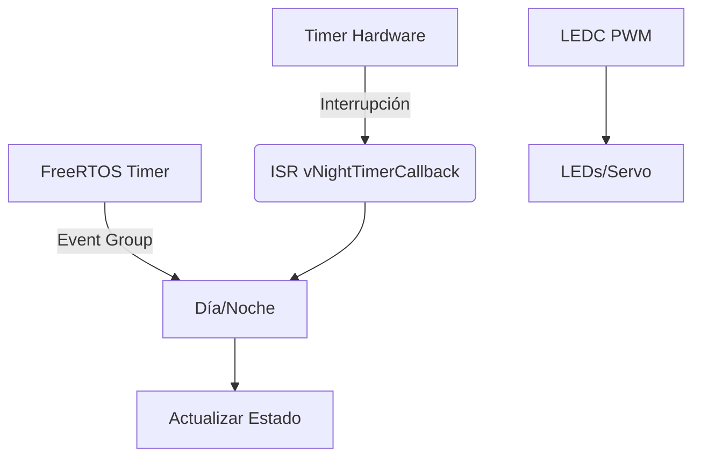

### **2. Funcionamiento Técnico: Timers, PWM y FreeRTOS**

#### **2.1. Timers en Sistemas Embebidos**  
Los timers son periféricos esenciales para la gestión del tiempo en sistemas embebidos. En el **ESP32-S3**, se implementan dos tipos principales:  

- **Timers Hardware**:  
  - **Timer Group (TG)**: El ESP32-S3 incluye 2 grupos (Timer Group 0 y 1), cada uno con 2 timers de 64 bits.  
    - Configuración típica:  
      ```c
      timer_config_t config = {
          .divider = 16,
          .counter_dir = TIMER_COUNT_UP,
          .counter_en = TIMER_PAUSE,
          .alarm_en = TIMER_ALARM_EN,
          .auto_reload = true
      };
      timer_init(TIMER_GROUP_0, TIMER_0, &config);
      ```  
  - **LEDC Timer**: Usado para PWM (módulo LED Control).  

- **Timers Software (FreeRTOS)**:  
  - Basados en el tick del sistema (configurable en `FreeRTOSConfig.h`).  
  - Ejemplo de creación:  
    ```c
    xTimerHandle xTimer = xTimerCreate(
        "TimerDemo",
        pdMS_TO_TICKS(1000),  // Periodo de 1s
        pdTRUE,               // Auto-reload
        NULL,
        vTimerCallback
    );
    ```  
  - **Precisión**: Depende de la frecuencia del tick (ej. 1ms para `portTICK_PERIOD_MS`).  

#### **2.2. FreeRTOS: Gestión de Tareas y Sincronización**  
- **Tareas**:  
  - En el proyecto, se usan 4 tareas con prioridades 1-3:  
    ```c
    xTaskCreate(dia_task, "DiaTask", 4096, NULL, 2, NULL);
    ```  
  - Stack size ajustado según necesidades (ej. 4096 bytes para `dia_task`).  

- **Event Groups**:  
  - Sincronización entre modos día/noche:  
    ```c
    EventBits_t bits = xEventGroupWaitBits(xDayNightEventGroup, DAY_BIT, pdFALSE, pdTRUE, portMAX_DELAY);
    ```  

- **Semáforos**:  
  - Protección de recursos compartidos (ej. `available_spaces`):  
    ```c
    if (xSemaphoreTake(spaces_mutex, portMAX_DELAY) == pdTRUE) {
        available_spaces--;
        xSemaphoreGive(spaces_mutex);
    }
    ```  

#### **2.3. PWM y Control de Actuadores**  
- **Teoría PWM**:  
  - Modulación por ancho de pulso para controlar potencia promedio (ciclo de trabajo).  
  - En el ESP32-S3, el módulo **LEDC** (LED Control) genera señales PWM:  
    - 8 canales independientes.  
    - Resolución configurable (ej. 13 bits en el proyecto).  

- **Configuración en Código**:  
  ```c
  ledc_channel_config_t ledc_channel = {
      .gpio_num = SPACES_AVAILABLE_LED,
      .speed_mode = LEDC_LOW_SPEED_MODE,
      .channel = LEDC_CHANNEL_0,
      .timer_sel = LEDC_TIMER_0,
      .duty = 0,
      .hpoint = 0
  };
  ```  
  - **Frecuencia**: 5 Hz (óptima para visualización humana).  

- **Aplicaciones**:  
  - Control de brillo en LEDs (`set_led_duty()`).  
  - Posicionamiento de servomotor (`servo_set_position()`).  

#### **2.4. Concurrencia y Protección de Recursos**  
- **Mutex vs Semáforos**:  
  - **Mutex**:  
    - Uso exclusivo para recursos compartidos (ej. `spaces_mutex` protege `available_spaces`).  
    - Prioridad inheritance para evitar inversión.  
  - **Semáforos Binarios**:  
    - Sincronización simple entre tareas/ISRs.  

- **Ejemplo Crítico**:  
  En `handle_button_press()`, se usa `spaces_mutex` para evitar race conditions al modificar `available_spaces`.  

---  
### **Diagrama de Flujo de Timers y PWM**  

**Leyenda**:  
- **ISR**: Interrupt Service Routine.  
- **LEDC**: Módulo hardware para PWM.  

---  
Este enfoque técnico muestra cómo los timers y el PWM permiten funcionalidades avanzadas en sistemas embebidos, garantizando precisión y eficiencia. ¿Necesitas profundizar en algún aspecto específico?
